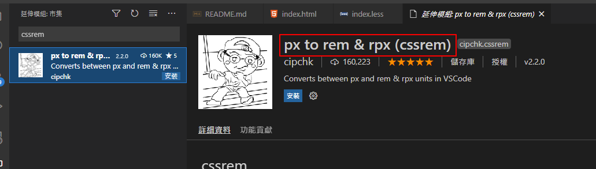
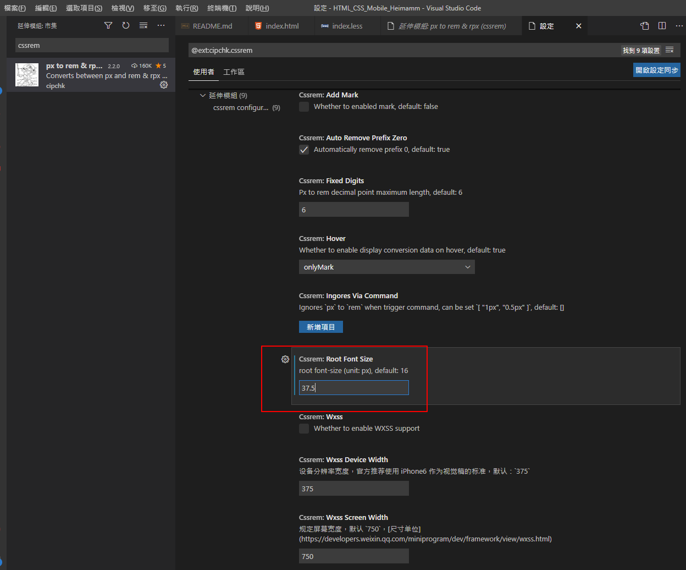
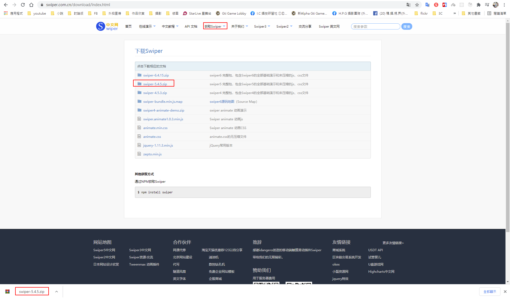
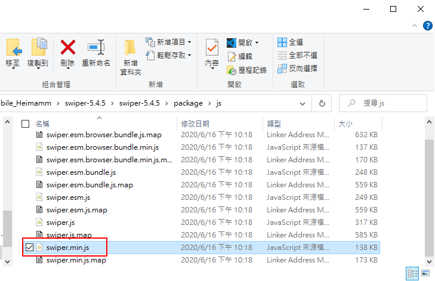
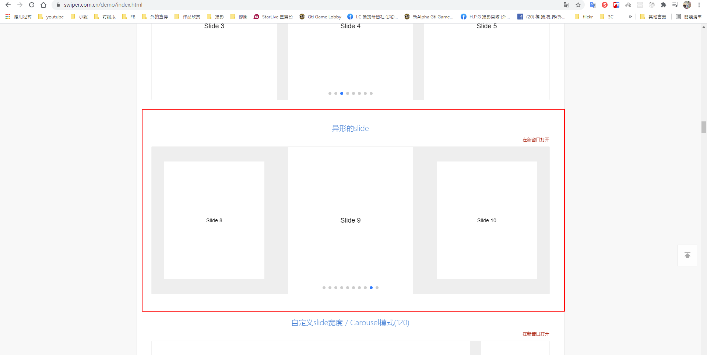
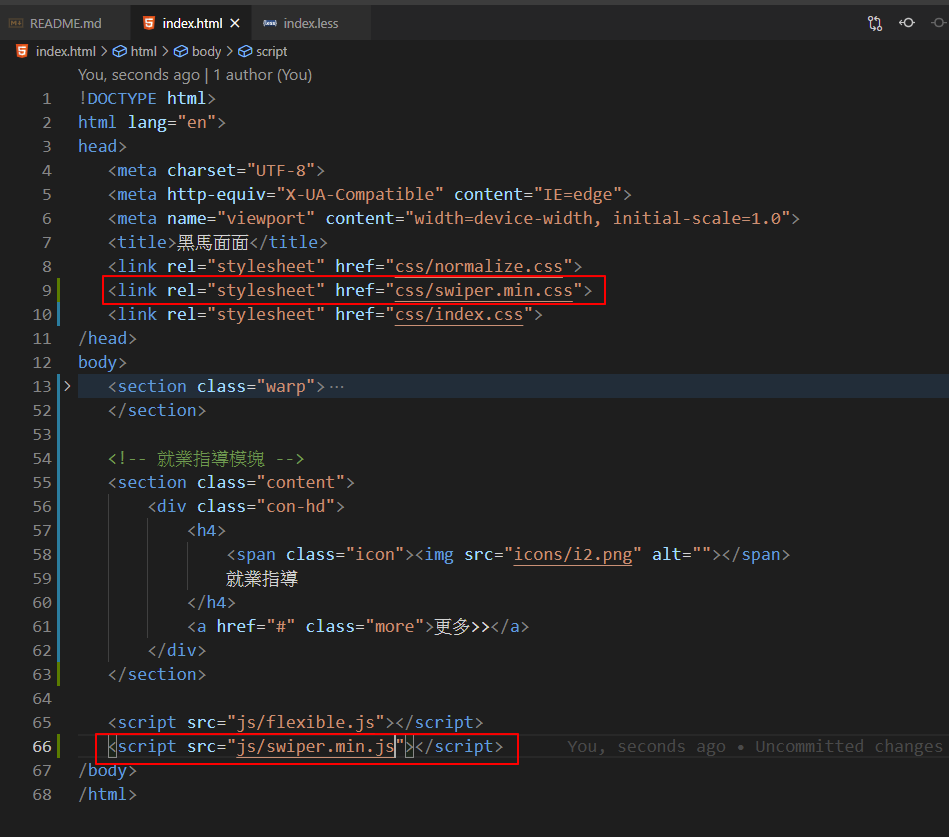
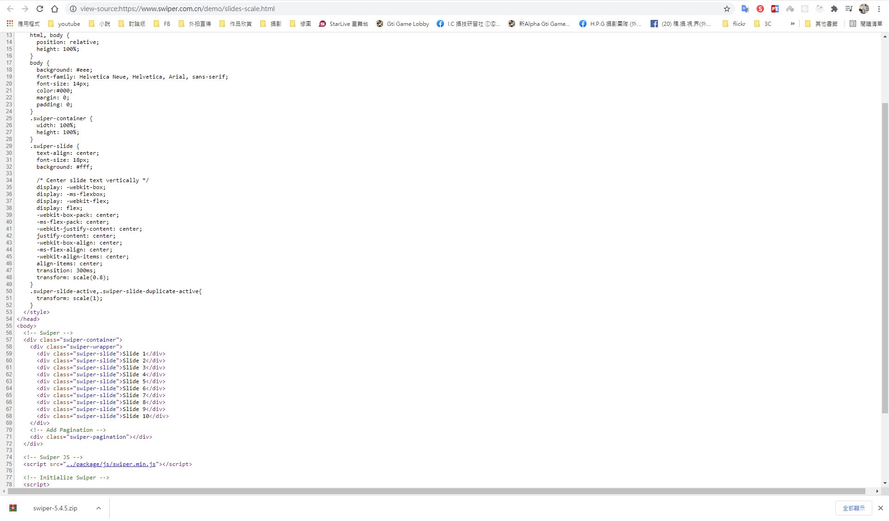
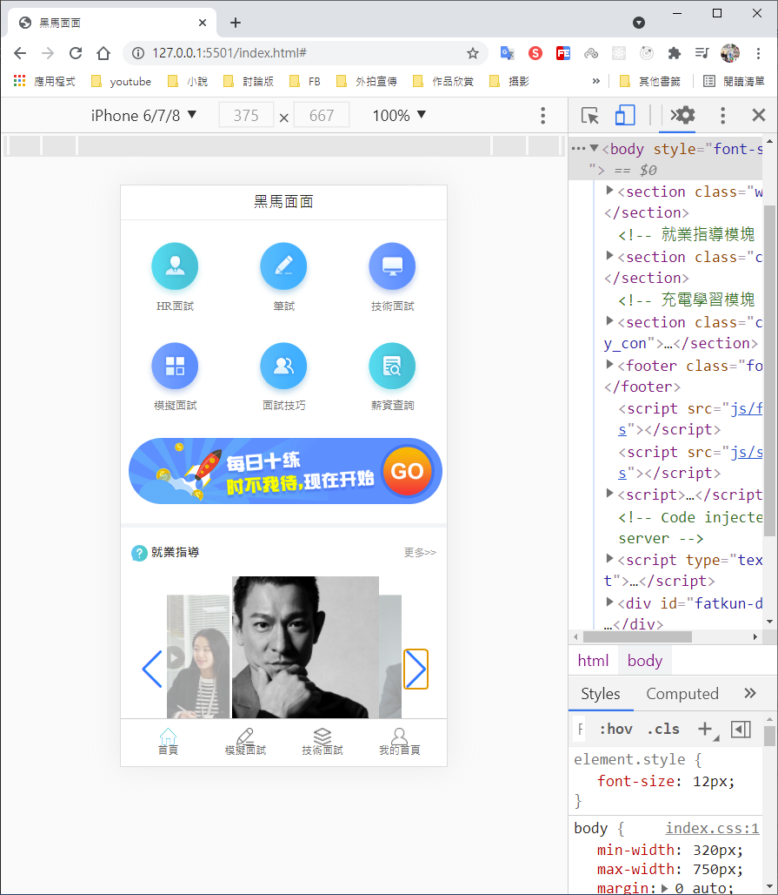

# HTML CSS Mobile 黑馬麵麵 首頁製作

# Github展示

本網頁為學習使用，若有侵權請告知，謝謝！

https://ivesshe.github.io/HTML_CSS_Mobile_Heimamm/


# 配置

- 方案： 單獨制作移動頁面方案
- 技術∶ 布局採取flex、rem、flexible.js、less


# 初始化文件

- 引入normalize.css
- lee中初始化body樣式

# 安裝插件cssrem



修改設定



## 使用swiper插件

https://www.swiper.com.cn/

下載




拷貝這個文件到項目js資料夾




找到合適的模板




在index引入swiper的css及js文件



檢視項目原始碼，拷貝所需要的樣式及js程式碼



樣式

```css
.swiper-container {
    width: 100%;
    height: 100%;
}
.swiper-slide {
    text-align: center; 
    font-size: 18px;
    background: #fff;

    /* Center slide text vertically */
    display: -webkit-box;
    display: -ms-flexbox;
    display: -webkit-flex;
    display: flex;
    -webkit-box-pack: center;
    -ms-flex-pack: center;
    -webkit-justify-content: center;
    justify-content: center;
    -webkit-box-align: center;
    -ms-flex-align: center;
    -webkit-align-items: center;
    align-items: center;
    transition: 300ms;
    transform: scale(0.8);
}
.swiper-slide-active,.swiper-slide-duplicate-active{
    transform: scale(1);
}
```

SCRIPT

```html
<script>
    var swiper = new Swiper('.swiper-container', {
      slidesPerView: 3,
      spaceBetween: 30,
	  centeredSlides: true,
	  loop: true,
      pagination: {
        el: '.swiper-pagination',
        clickable: true,
      },
    });
  </script>
```

使用上可以參考API


# 完成畫面


